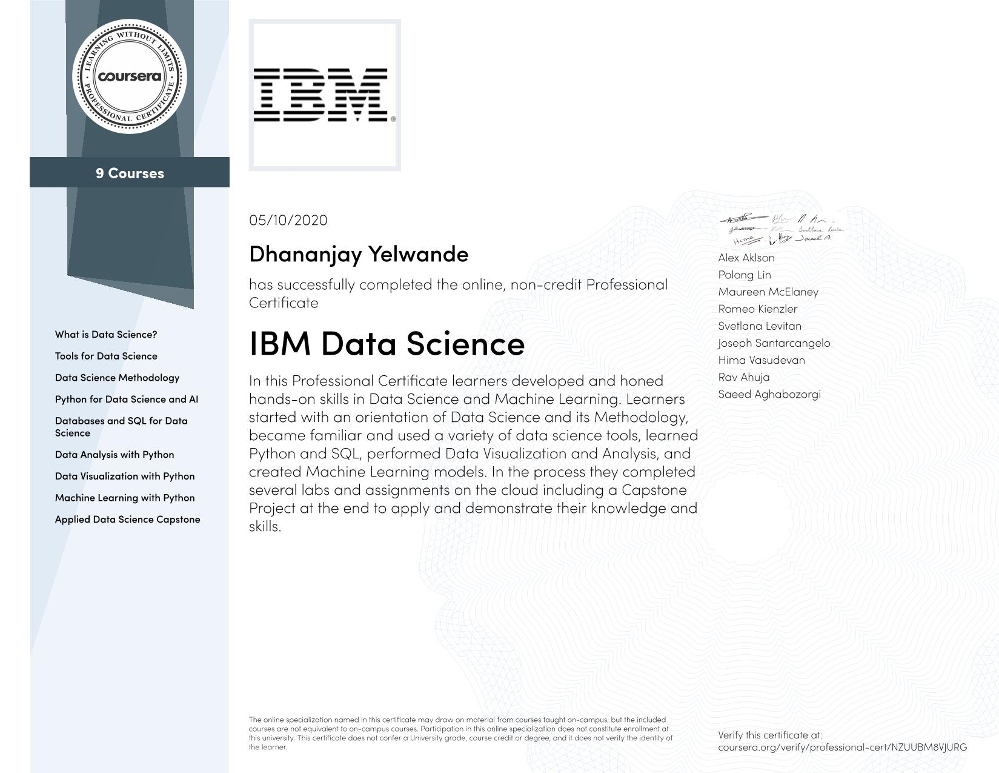
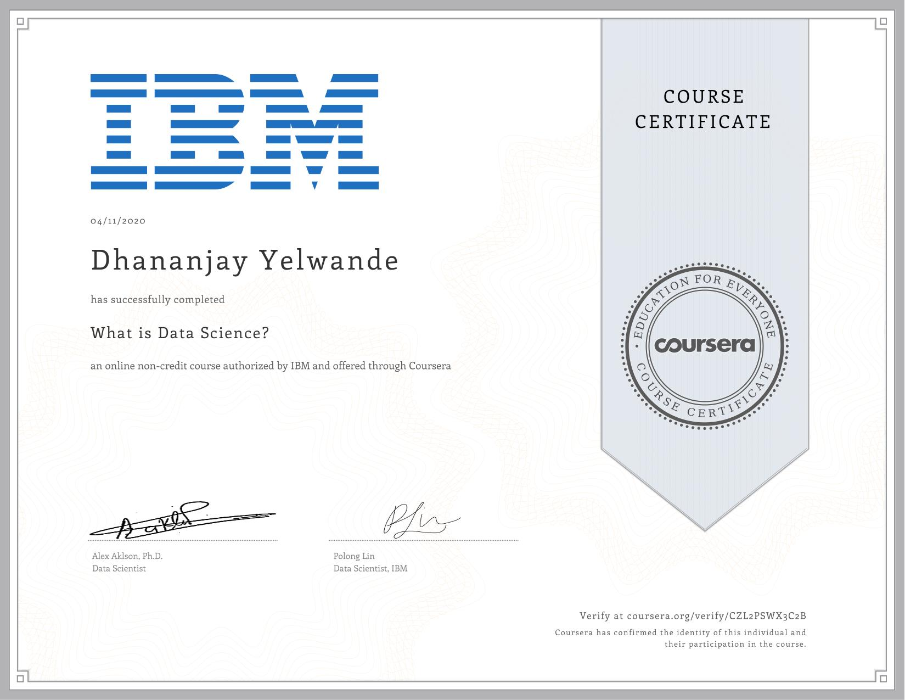
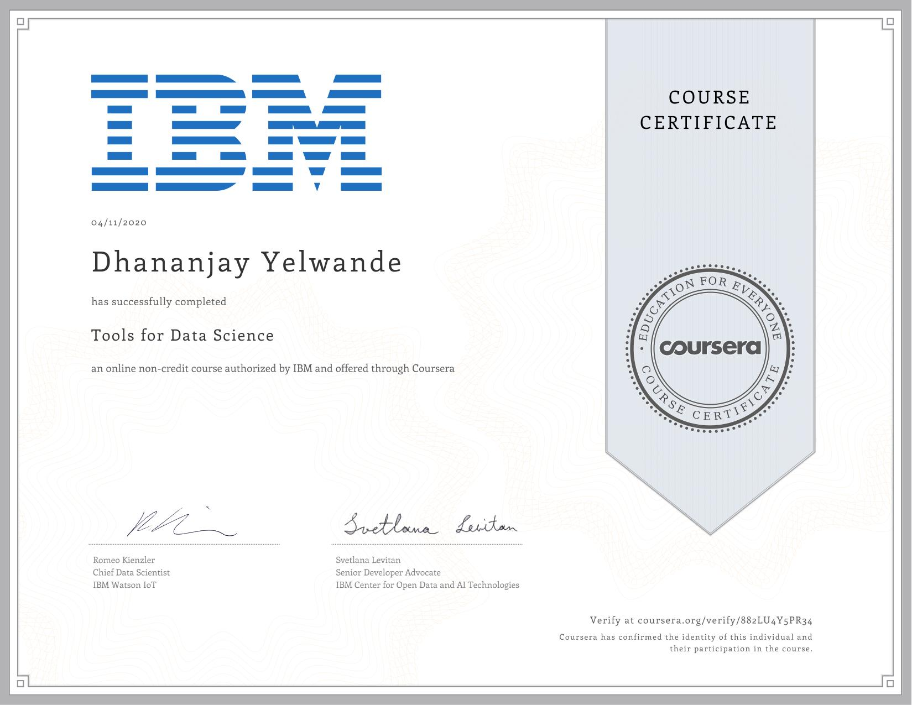
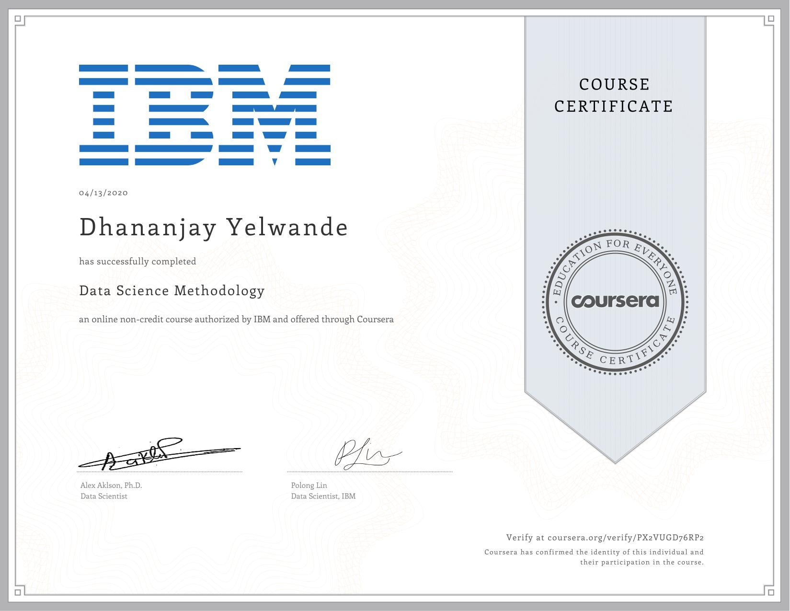
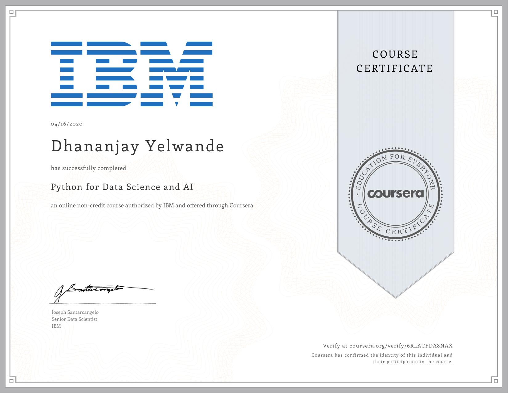
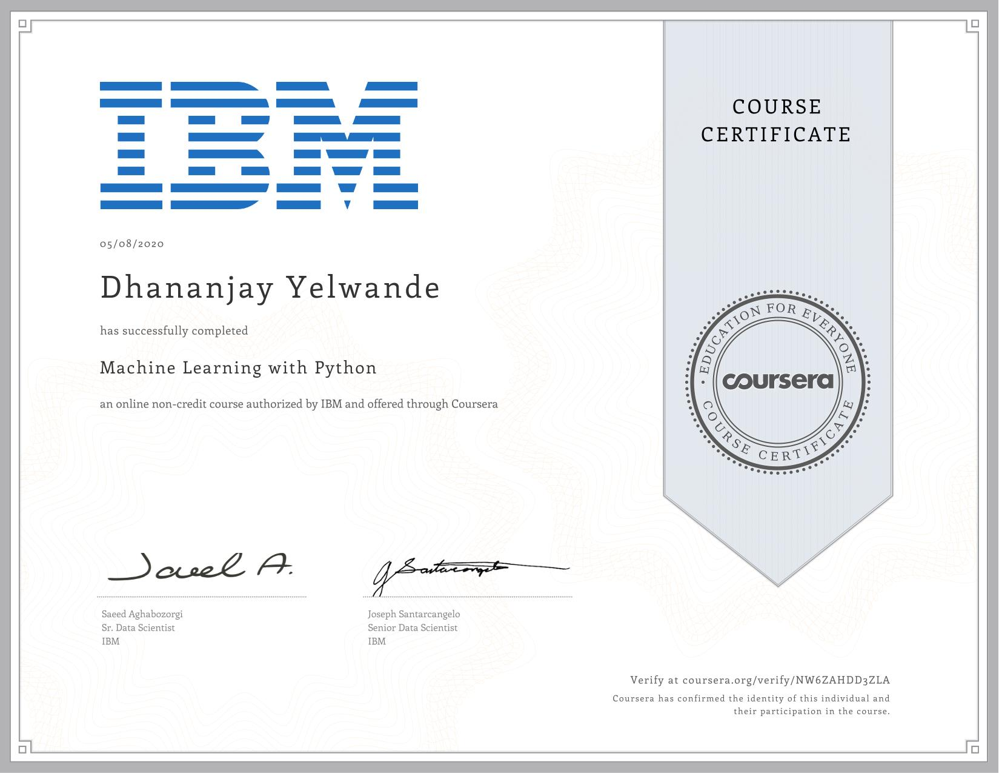
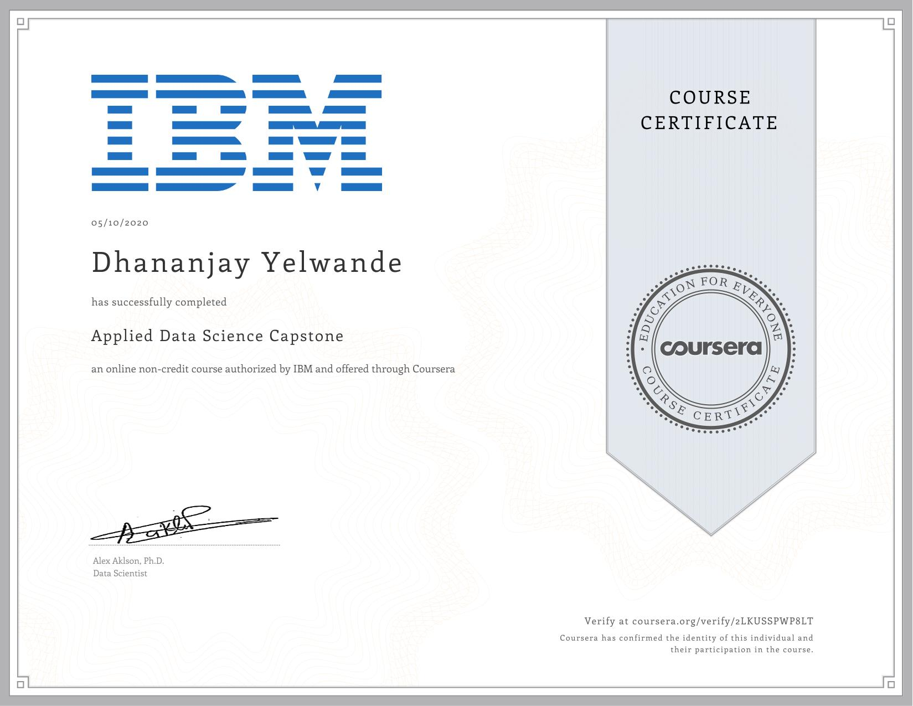

<h2 align="center"> IBM Data Science Specialization by Coursera </h2>

> I got 1st month complimentary on IBM's Data Science Professional Certificate subscription on Coursera when I joined IBM's Data Science Community. This initiative was IBM's response to Covid-19. Completed the specialization in one month with focus and commitment. Learned a lot. Project information coming soon!
---

  <a href="https://coursera.org/share/ba0f0dcebca81663024457e9bd3c7685">Click to verify this certificate</a>

IBM Data Science    |
:-------------------------:|
 |

What is Data Science?      |  Tools for Data Science   | Data Science Methodology
:-------------------------:|:-------------------------:|:-------------------------:
 |   | 

Python for Data Science and AI | Databases and SQL for Data Science | Data Analysis with Python
:-------------------------:|:-------------------------:|:-------------------------:
 |   | 

Data Visualization with Python | Machine Learning with Python | Applied Data Science Capstone
:-------------------------:|:-------------------------:|:-------------------------:
 |   | 
